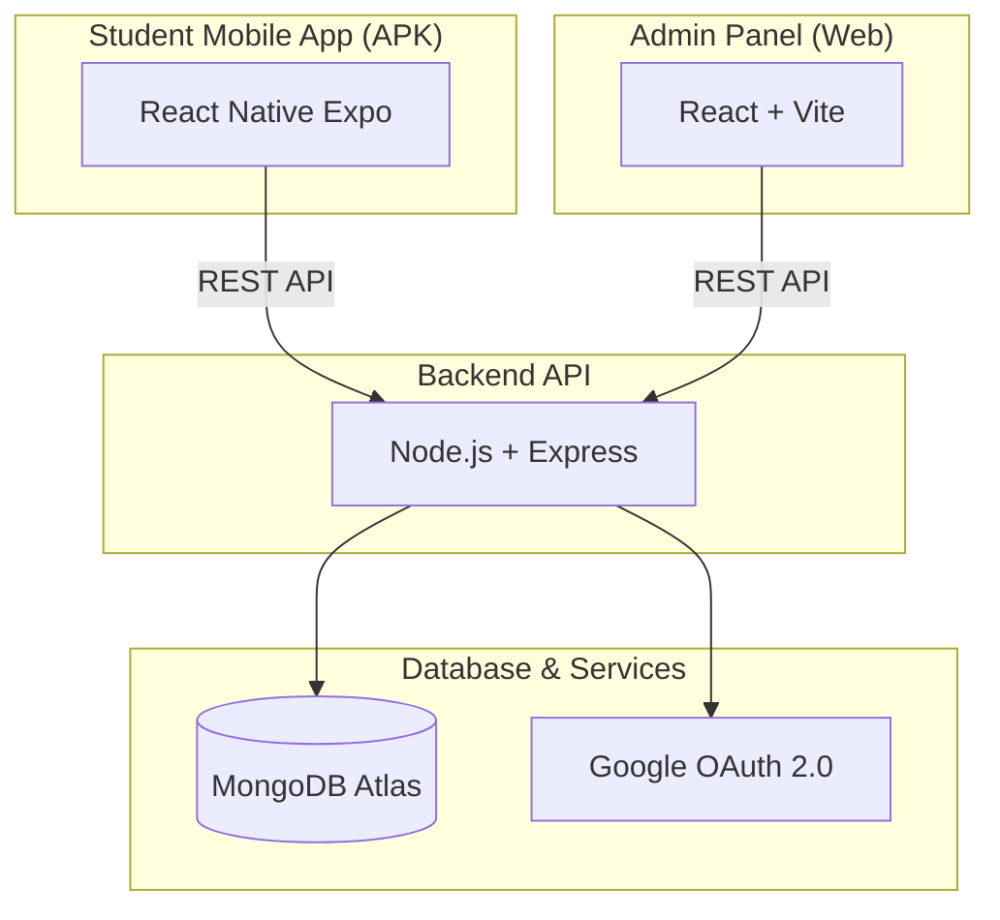
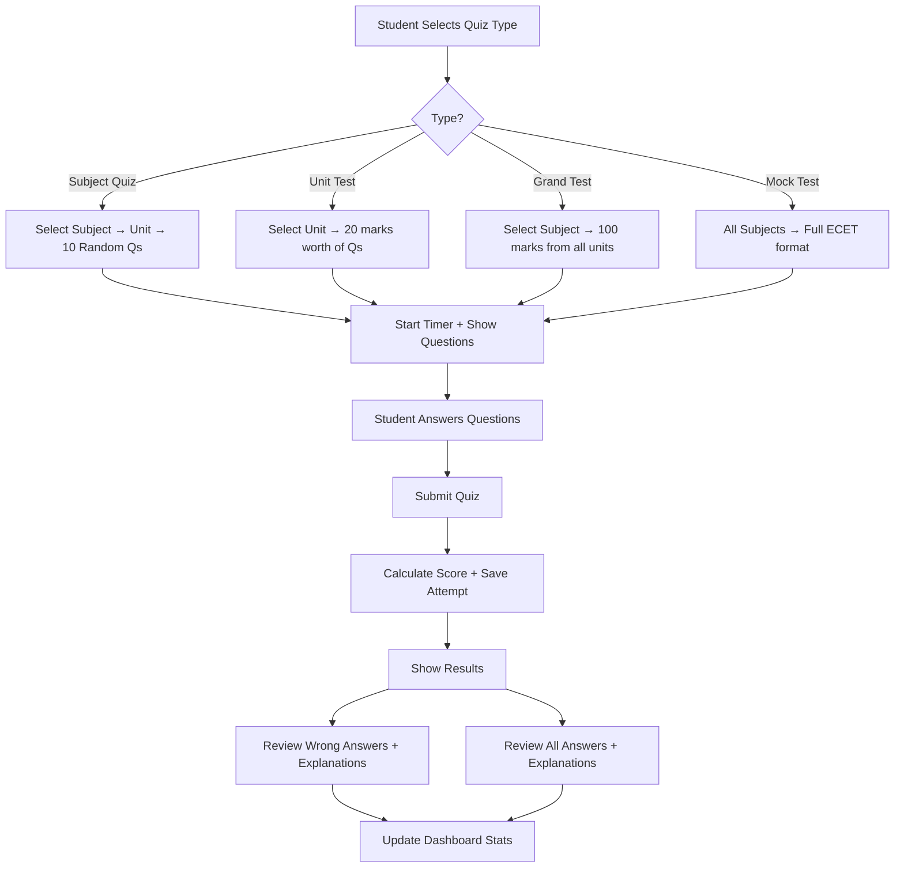

# 🎯 ECET Crack — Real-Time ECET Preparation Android App

A full-stack MERN application with React Native Expo mobile app for students and a React web admin panel, designed to help diploma students crack ECET and secure top college seats.

## Architecture Overview



### Tech Stack

| Layer | Technology | Purpose |
|-------|-----------|---------|
| **Mobile App** | React Native + Expo SDK 52 | Android APK for students |
| **Admin Panel** | React + Vite | Web-based content management |
| **Backend** | Node.js + Express.js | REST API server |
| **Database** | MongoDB (Mongoose ODM) | Data storage |
| **Auth** | Google OAuth 2.0 + JWT | Authentication |
| **File Storage** | Local uploads + MongoDB refs | PDFs, notes, images |
| **APK Build** | Expo EAS Build / `expo prebuild` + Gradle | Generate APK |

---

## User Review Required

> [!IMPORTANT]
> **ECET Subjects**: The app will include **Mathematics, Physics, Chemistry** as common subjects, plus branch-specific subjects like **CSE, ECE, EEE, Mechanical, Civil**. Please confirm which branches you want to include initially.

> [!IMPORTANT]
> **MongoDB**: We'll use MongoDB with a local connection string for development. You'll need a MongoDB Atlas account for production. Is local MongoDB installed, or should we use MongoDB Atlas free tier from the start?

> [!IMPORTANT]
> **Google OAuth**: You'll need a Google Cloud Console project with OAuth 2.0 credentials (Client ID). Do you already have one, or should the plan include setup instructions?

> [!IMPORTANT]
> **APK Build**: Building the final APK requires either Expo EAS (cloud build, free tier available) or local Android SDK + JDK setup. Which do you prefer?

---

## Proposed Changes

### Project Structure

```
ECET_app/
├── backend/                    # Node.js + Express API
│   ├── config/
│   │   └── db.js              # MongoDB connection
│   ├── models/
│   │   ├── User.js            # Student/Admin user model
│   │   ├── Subject.js         # Subjects & units
│   │   ├── Question.js        # Quiz questions with explanations
│   │   ├── Quiz.js            # Quiz sessions (unit/grand/mock)
│   │   ├── QuizAttempt.js     # Student quiz attempts & answers
│   │   ├── Note.js            # Study notes metadata
│   │   └── Notification.js    # Push notifications
│   ├── routes/
│   │   ├── auth.js            # Google OAuth + JWT
│   │   ├── subjects.js        # Subject CRUD
│   │   ├── questions.js       # Question CRUD + JSON bulk upload
│   │   ├── quizzes.js         # Quiz generation & submission
│   │   ├── attempts.js        # Quiz attempts & results
│   │   ├── notes.js           # Notes CRUD + file upload
│   │   ├── dashboard.js       # Analytics & leaderboard
│   │   ├── notifications.js   # Notification management
│   │   └── admin.js           # Admin management routes
│   ├── middleware/
│   │   ├── auth.js            # JWT verification
│   │   └── admin.js           # Admin role check
│   ├── uploads/               # PDF/image storage
│   ├── server.js              # Express entry point
│   └── package.json
│
├── admin/                      # React Admin Panel (Vite)
│   ├── src/
│   │   ├── components/
│   │   │   ├── Layout/        # Sidebar, Header, etc.
│   │   │   ├── Dashboard/     # Admin dashboard widgets
│   │   │   ├── Questions/     # Question management + JSON upload
│   │   │   ├── Subjects/      # Subject/unit management
│   │   │   ├── Notes/         # Notes upload & management
│   │   │   ├── Users/         # Student management
│   │   │   └── Notifications/ # Push notification sender
│   │   ├── pages/             # Route pages
│   │   ├── services/          # API service layer
│   │   ├── App.jsx
│   │   └── main.jsx
│   └── package.json
│
├── mobile/                     # React Native Expo App
│   ├── app/                   # Expo Router file-based routing
│   │   ├── (auth)/            # Auth screens
│   │   │   ├── login.jsx      # Google Sign-In
│   │   │   └── onboarding.jsx # Profile setup
│   │   ├── (tabs)/            # Main tab navigator
│   │   │   ├── index.jsx      # Dashboard/Home
│   │   │   ├── quiz.jsx       # Quiz categories
│   │   │   ├── notes.jsx      # Study notes
│   │   │   ├── leaderboard.jsx # Rankings
│   │   │   └── profile.jsx    # User profile
│   │   ├── quiz/
│   │   │   ├── [id].jsx       # Active quiz screen
│   │   │   └── result.jsx     # Quiz results + review
│   │   └── _layout.jsx        # Root layout
│   ├── components/
│   │   ├── QuizCard.jsx       # Quiz option card
│   │   ├── QuestionView.jsx   # Question renderer
│   │   ├── Timer.jsx          # Quiz timer
│   │   ├── ProgressChart.jsx  # Performance charts
│   │   ├── NoteCard.jsx       # Note preview card
│   │   └── SubjectCard.jsx    # Subject selector
│   ├── services/
│   │   └── api.js             # Axios API client
│   ├── contexts/
│   │   └── AuthContext.jsx    # Auth state management
│   ├── constants/
│   │   └── theme.js           # Colors, fonts, spacing
│   ├── app.json               # Expo config
│   └── package.json
│
└── README.md
```

---

### Phase 1: Backend API

#### [NEW] [server.js](file:///c:/Users/srira/Desktop/NO%20Range/ECET_app/backend/server.js)
- Express server with CORS, JSON parsing, file upload (multer)
- MongoDB connection via Mongoose
- Route mounting for all API endpoints
- JWT middleware for protected routes

#### [NEW] [Models](file:///c:/Users/srira/Desktop/NO%20Range/ECET_app/backend/models)
**User Model**: `name, email, googleId, avatar, branch, college, role(student/admin), quizStats{totalAttempts, avgScore, subjectScores}, createdAt`

**Subject Model**: `name, code, branch, description, units[{unitNumber, name, topics[]}], isCommon`

**Question Model**: `subject, unit, questionText, options[4], correctAnswer(index), explanation, difficulty(easy/medium/hard), marks, createdBy, tags[]`

**QuizAttempt Model**: `user, quizType(subject/unit/grand/mock), subject, unit, questions[{question, selectedAnswer, isCorrect, timeTaken}], score, totalMarks, percentage, startedAt, completedAt`

**Note Model**: `title, subject, unit, type(pdf/markdown), content(for md), fileUrl(for pdf), thumbnail, uploadedBy, downloads, createdAt`

**Notification Model**: `title, body, type(quiz/note/general), targetBranch, createdBy, createdAt`

#### [NEW] [Routes](file:///c:/Users/srira/Desktop/NO%20Range/ECET_app/backend/routes)
| Route | Method | Description |
|-------|--------|-------------|
| `/api/auth/google` | POST | Google OAuth login, returns JWT |
| `/api/auth/profile` | PUT | Update user profile (branch, college) |
| `/api/subjects` | GET/POST/PUT/DELETE | Subject CRUD |
| `/api/questions` | GET/POST/PUT/DELETE | Question CRUD |
| `/api/questions/bulk-upload` | POST | JSON bulk upload of questions |
| `/api/quizzes/generate` | POST | Generate quiz (by type, subject, unit) |
| `/api/quizzes/submit` | POST | Submit quiz answers, calculate score |
| `/api/attempts` | GET | Get user's quiz history |
| `/api/attempts/:id/review` | GET | Get detailed review (wrong + correct) |
| `/api/notes` | GET/POST/PUT/DELETE | Notes CRUD + file upload |
| `/api/dashboard` | GET | User stats, charts data |
| `/api/dashboard/leaderboard` | GET | Top scorers |
| `/api/notifications` | GET/POST | Notifications CRUD |
| `/api/admin/stats` | GET | Admin analytics |
| `/api/admin/users` | GET | All users list |

---

### Phase 2: Admin Panel (React + Vite)

#### [NEW] [Admin App](file:///c:/Users/srira/Desktop/NO%20Range/ECET_app/admin)
A beautiful, dark-themed admin panel with:

- **Dashboard**: Total students, quizzes taken, questions count, active users chart
- **Question Manager**: 
  - Upload questions via JSON file (sector/subject/unit-wise)
  - JSON format: `{subject, unit, questions: [{text, options, correct, explanation}]}`
  - Inline question editor with preview
  - Filter by subject, unit, difficulty
- **Subject Manager**: Add/edit subjects and units
- **Notes Manager**: Upload PDFs and write Markdown notes with preview
- **User Manager**: View students, their stats, manage admin roles
- **Notification Center**: Send push notifications to all or specific branches

---

### Phase 3: Mobile App (React Native Expo)

#### [NEW] [Mobile App](file:///c:/Users/srira/Desktop/NO%20Range/ECET_app/mobile)
Premium student-facing mobile app with:

**🎨 Design Language**:
- Dark gradient theme with neon accent colors
- Glassmorphism cards with blur effects  
- Smooth animations (React Native Reanimated)
- Custom fonts (Outfit/Inter from Google Fonts)

**📱 Screens**:

1. **Login Screen**: Beautiful gradient with Google Sign-In button, particle animations
2. **Onboarding**: Select branch, enter college name
3. **Home/Dashboard**: 
   - Welcome banner with streak count
   - Performance rings (overall, per subject)
   - Recent quiz scores
   - Quick-start quiz buttons
   - Daily challenge card
4. **Quiz Categories**:
   - **Subject Quiz**: Pick subject → pick unit → start quiz
   - **Unit Test (20 marks)**: Select unit → 20 mark timed test
   - **Grand Test (100 marks)**: Select subject → all units, 100 marks
   - **Mock Test**: Full ECET simulation (all subjects, timed)
5. **Active Quiz Screen**:
   - Question counter + timer bar
   - Question text with syntax highlighting
   - 4 option buttons with tap selection
   - Previous/Next/Submit navigation
   - Flag for review
6. **Results Screen**:
   - Score with animated circular progress
   - Time taken, accuracy percentage
   - Subject-wise breakdown (for grand/mock)
   - "Review Wrong Answers" button → shows wrong answers with ✅ correct answer + 📝 explanation
   - "Review All Answers" button → full review
7. **Study Notes**: 
   - Subject-wise categorized notes
   - PDF viewer with zoom/scroll
   - Colorful Markdown renderer
8. **Leaderboard**: Top scorers with avatars, animated ranks
9. **Profile**: Stats, quiz history, settings

---

### Phase 4: Quiz Engine Logic



**Scoring Rules**:
- Unit Test: 20 questions × 1 mark = 20 marks
- Grand Test: 100 questions × 1 mark = 100 marks  
- Mock Test: 200 questions (matching ECET pattern), timed at 3 hours
- No negative marking (configurable by admin)

---

### Phase 5: JSON Upload Format (for Admin)

The admin uploads questions in this JSON structure (sector/subject/unit-wise):

```json
{
  "subject": "Mathematics",
  "unit": 1,
  "unitName": "Matrices",
  "questions": [
    {
      "text": "If A is a 3×3 matrix with |A| = 5, then |adj(A)| = ?",
      "options": ["5", "25", "125", "1/5"],
      "correct": 1,
      "explanation": "For an n×n matrix, |adj(A)| = |A|^(n-1). Here n=3, so |adj(A)| = 5^2 = 25",
      "difficulty": "medium"
    }
  ]
}
```

---

## Verification Plan

### Automated Tests
1. **Backend API Testing**:
   ```bash
   cd ECET_app/backend
   node server.js
   # Test endpoints with curl/Postman - server should start on port 5000
   ```

2. **Admin Panel**:
   ```bash
   cd ECET_app/admin
   npm run dev
   # Open http://localhost:5173 - admin panel should load
   ```

3. **Mobile App**:
   ```bash
   cd ECET_app/mobile
   npx expo start --web
   # Open in browser to verify UI renders correctly
   ```

### Manual Verification
1. **Admin Flow**: Open admin panel → Login → Upload JSON questions → Verify questions appear in database
2. **Quiz Flow**: Open mobile app → Login → Start quiz → Answer questions → Submit → View results → Review wrong answers with explanations
3. **APK Build**: Run `eas build --platform android --profile preview` or local Gradle build to generate APK

### Browser Testing
- Test admin panel UI in browser for responsiveness and functionality
- Test mobile app web view via Expo web for layout verification
